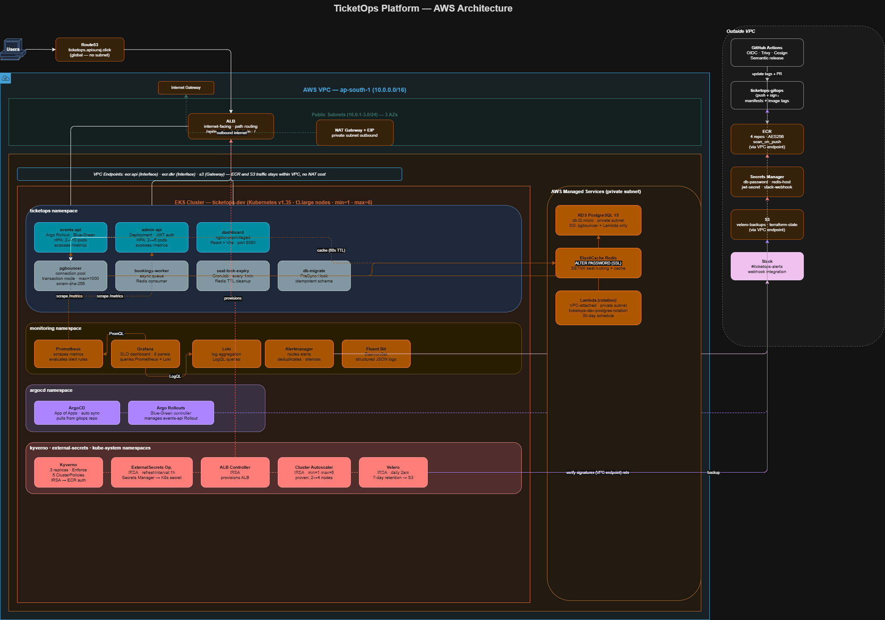
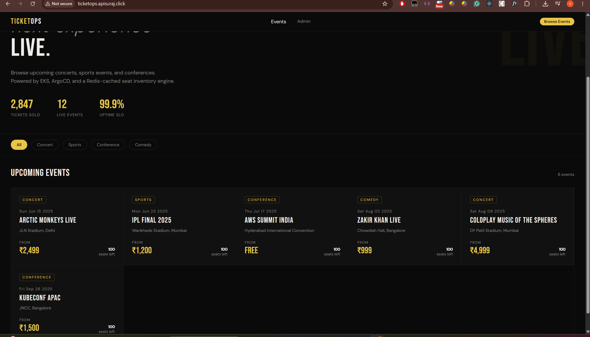
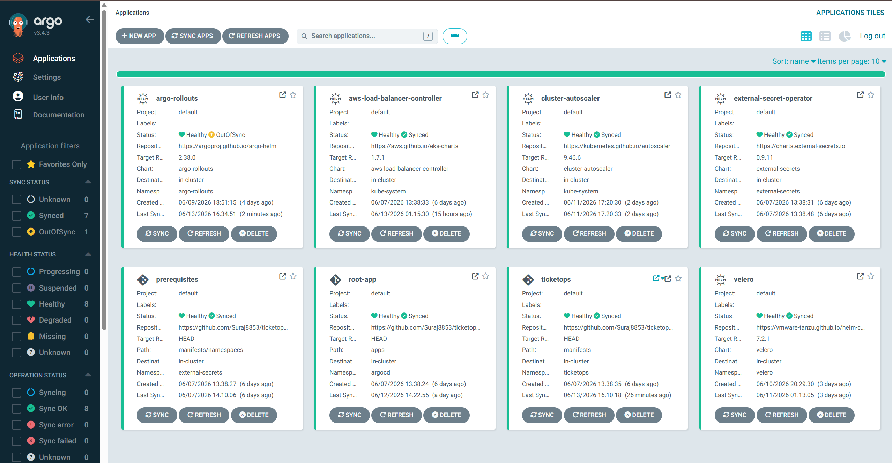
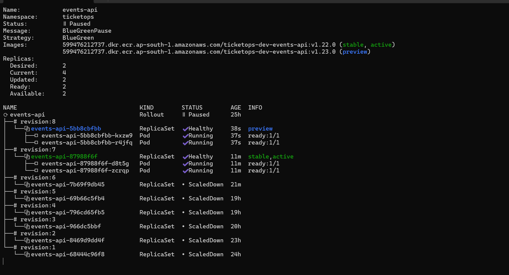
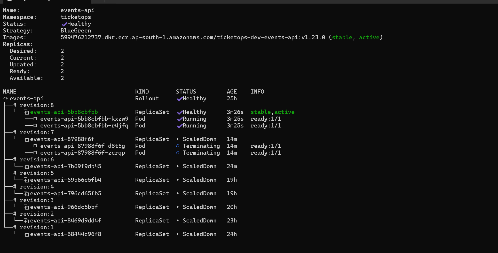
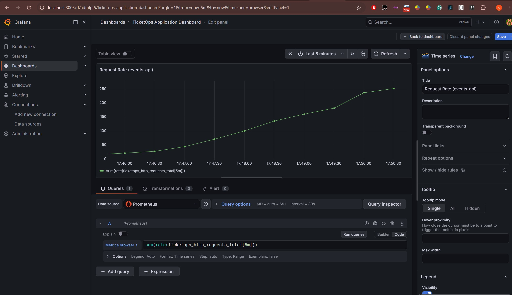
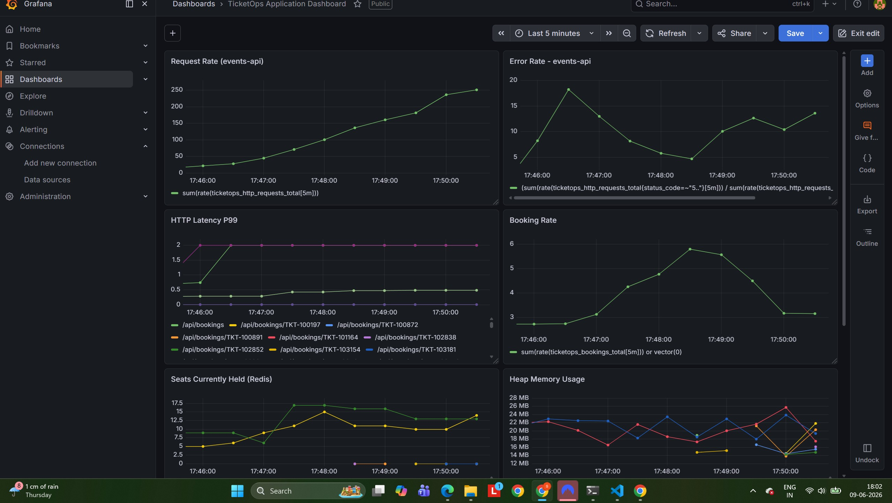
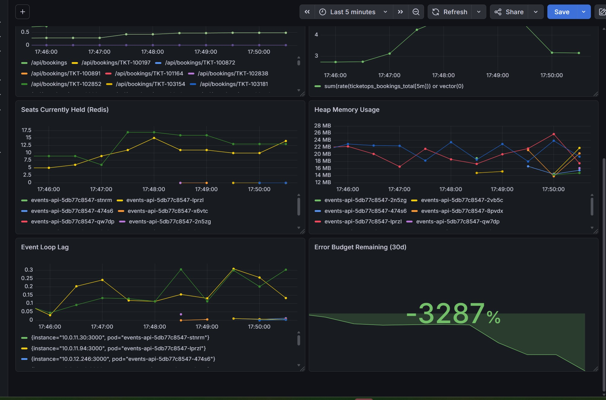
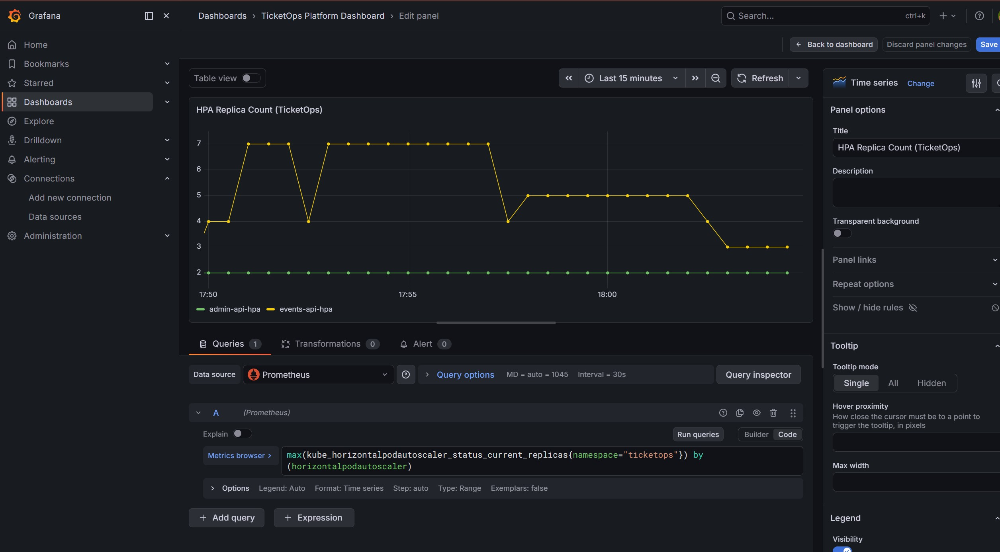
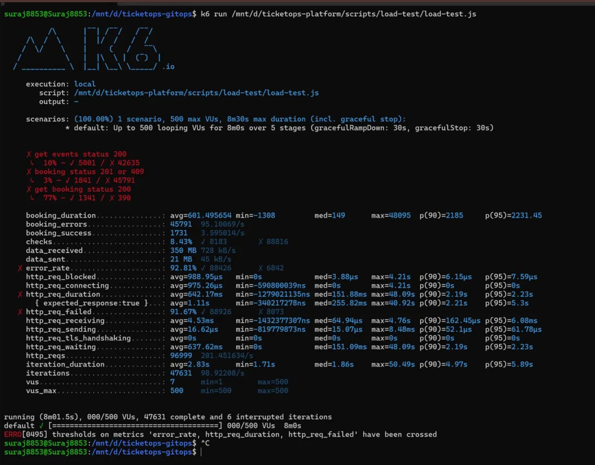

# TicketOps Platform

A production-grade event ticketing system running on AWS EKS. Built to simulate how a real SaaS company runs its infrastructure — GitOps, observability, security policies, progressive delivery, the works.

**Live:** [ticketops.apisuraj.click](http://ticketops.apisuraj.click)  
**App code:** [github.com/Suraj8853/ticketops-platform](https://github.com/Suraj8853/ticketops-platform)  
**K8s manifests:** [github.com/Suraj8853/ticketops-gitops](https://github.com/Suraj8853/ticketops-gitops)

---

## Architecture



---

## What this is

TicketOps lets users browse events, select seats, and book tickets. Under the hood it's a 4-service Node.js backend on EKS, with PostgreSQL via RDS, Redis via ElastiCache, and a React dashboard.

The application itself is fairly simple. The point was to build everything around it the way you'd actually do it at a company — Terraform for infra, ArgoCD for GitOps, Prometheus/Grafana for observability, Kyverno for policy enforcement, Cosign for image signing, Velero for backups, and Argo Rollouts for zero-downtime deployments.

Built across 8 phases over several weeks.

---

## How it's structured

```
Users → Route53 (ticketops.apisuraj.click)
           → ALB
               → /api/events  → events-api  → pgbouncer → RDS PostgreSQL
               → /api/admin   → admin-api   → pgbouncer
               → /            → dashboard (React)

bookings-worker → Redis (async job processing)
seat-lock-expiry CronJob → Redis (releases expired locks every minute)
db-migrate Job (PreSync) → RDS (schema migrations before each deploy)
```

All infra is in ap-south-1. EKS cluster is `ticketops-dev-cluster`, t3.large nodes.

---

## Tech used

**Infrastructure:** Terraform (10 reusable modules), remote state in S3 (`ticketops-terraform-state-599476212737`) with DynamoDB locking (`ticketops-terraform-locks`)

**Kubernetes:** EKS v1.35, ArgoCD App of Apps, Argo Rollouts, External Secrets Operator, AWS Load Balancer Controller, Cluster Autoscaler, metrics-server

**Observability:** Prometheus (kube-prometheus-stack), Grafana, Loki, Fluent Bit, Alertmanager → Slack

**Security:** Kyverno (4 policies, Enforce mode), Cosign (keyless signing), Trivy (CI scanning), NetworkPolicy (default deny-all), RBAC (per-service ServiceAccounts)

**CI/CD:** GitHub Actions, OIDC auth (no static AWS credentials), semantic versioning, ECR, Velero, k6

---

## The services

**events-api** — handles event listing and seat availability. Uses Redis to cache responses (60s TTL). When a user selects a seat, Redis SETNX creates a time-limited lock so two people can't book the same seat. Deployed as an Argo Rollout (Blue-Green). HPA scales it 2→10 pods on CPU.

**admin-api** — event management and booking administration, JWT auth. Standard Deployment. HPA min=2 max=5.

**dashboard** — React frontend served by nginx-unprivileged (port 8080, non-root). Standard Deployment.

**bookings-worker** — processes bookings async from a Redis queue. Standard Deployment.

**seat-lock-expiry** — CronJob that runs every minute and clears expired Redis seat locks. Prevents seats getting permanently stuck if a user abandons checkout.

**db-migrate** — PreSync ArgoCD hook. Runs schema migrations before every deployment so the DB is always in sync. Uses `WHERE NOT EXISTS` for idempotent seeding — safe to run multiple times.

---

## Infrastructure

### VPC

Standard 3-tier setup:
- `10.0.0.0/16` VPC
- 3 public subnets (`10.0.1-3.0/24`) — just for the ALB
- 3 private subnets (`10.0.11-13.0/24`) — EKS nodes, RDS, ElastiCache
- NAT Gateway + Elastic IP for outbound from private subnets
- VPC Endpoints for ECR (api + dkr) and S3 — so Kyverno can verify image signatures without going through NAT

### ECR repos

4 repos: `ticketops-dev-events-api`, `ticketops-dev-bookings-worker`, `ticketops-dev-admin-api`, `ticketops-dev-dashboard`

All have `scan_on_push = true`, AES256 encryption, and a lifecycle policy that keeps the last 10 images.

### IAM

OIDC provider for GitHub Actions — no static credentials anywhere. Each AWS-integrated K8s component (ExternalSecrets, ALB Controller, Cluster Autoscaler, Kyverno, Velero) gets its own IRSA role with least-privilege permissions.

---

## CI/CD

Push to main → semantic release determines version → builds all 4 images in parallel → Trivy scans each one → pushes to ECR → Cosign signs the image → updates image tags in ticketops-gitops → creates a PR.

After the PR is merged, ArgoCD picks it up and deploys. events-api goes through Blue-Green (pauses for manual promotion). Everything else does a rolling update.

The semantic versioning is commit-message driven: `feat:` bumps minor, `fix:` bumps patch. So `git commit -m "feat: add category filter"` automatically becomes `v1.22.0`.

---

## GitOps

ArgoCD uses the App of Apps pattern. A single `root-app` syncs everything from the `apps/` directory in ticketops-gitops, which in turn creates child apps for the main workloads, Argo Rollouts, Cluster Autoscaler, ALB Controller, etc.

Sync waves control deployment order: secrets and ExternalSecrets sync first (wave 1-2), then workloads (wave 3-4), then ingress (wave 5). This avoids race conditions where pods start before their secrets exist.

The Argo Rollout has `argocd.argoproj.io/compare-options: IgnoreExtraneous` — without this, ArgoCD fights with Argo Rollouts during blue-green pause because the live state doesn't match the gitops spec.

---

## Observability

### Metrics

Both events-api and admin-api expose Prometheus metrics via prom-client v15:

- `http_requests_total` — broken down by method, route, status code
- `http_request_duration_seconds` — histogram, used for P50/P95/P99
- `booking_total` — bookings by status
- `seats_held_total` — how many seats are currently locked in Redis

Grafana SLO dashboard has 8 panels: request rate, error rate (SLO: <0.1%), P99 latency (SLO: <500ms), booking rate, seats held, heap memory, event loop lag, and an error budget panel.

### Alerts

5 alert rules in PrometheusRules (ticketops namespace, `release: prometheus` label so Prometheus picks them up):

- `HighErrorRate` — error rate >1% for 5 minutes
- `HighLatencyP99` — P99 >500ms for 5 minutes  
- `PodCrashLoops` — pod restarting more than 3 times in 15 minutes
- `HighHeapMemory` — heap above 80% of memory limit
- `EventLoopLagHigh` — event loop lag over 100ms

Alertmanager routes to Slack. The webhook URL lives in Secrets Manager and gets synced into the cluster via ExternalSecret. The Alertmanager config is set in Helm values rather than the AlertmanagerConfig CRD — the CRD automatically adds `namespace=monitoring` matchers which break cross-namespace alert routing.

### Logging

Fluent Bit DaemonSet collects all container logs and ships to Loki. All services emit structured JSON with a `request_id` field so you can trace a single request across multiple services in Grafana.

---

## Security

### Kyverno

4 ClusterPolicies enforced in the ticketops namespace:

- **require-labels** — pods need `app` and `version` labels
- **disallow-root-containers** — `runAsNonRoot: true` required
- **disallow-latest-tag** — tag `latest` is blocked
- **requires-resources-limits** — CPU and memory limits required on every container
- **verify-image-signature** — only Cosign-signed images allowed (enforced via IRSA + VPC endpoints)

Started in Audit mode, fixed all violations across every workload (added securityContext, version labels, resource limits, switched dashboard from `nginx:alpine` to `nginxinc/nginx-unprivileged`), then switched to Enforce. Verified with `kubectl run test-pod --image=nginx:latest` — correctly rejected.

Kyverno runs with 3 admission controller replicas. `failurePolicy: Ignore` on webhooks so a slow Kyverno doesn't block all pod creation. `autoUpdateWebhooks: false` so Kyverno doesn't keep reverting our webhook patches. Timeout extended to 30s.

### Image signing

Every image gets signed in CI using Cosign keyless signing — no private key stored anywhere. The signing identity is the GitHub Actions OIDC token. Signatures stored in ECR and recorded in the Rekor transparency log. Kyverno verifies signatures at pod admission using an IRSA role that can read from ECR.

### Network

Default deny-all NetworkPolicy in the ticketops namespace. Each service has an explicit policy allowing only the traffic it needs. No pod can talk directly to RDS — everything goes through pgbouncer-service.

---

## Progressive Delivery

Started with canary (20% → 40% → 60% → 100% with 2-minute pauses between steps). Ran 3 successful canary deployments: v1.8.0 → v1.9.0 → v1.10.0.

Switched to Blue-Green on mentor requirement. Now events-api deployments create a GREEN ReplicaSet pointing to a preview service. BLUE keeps serving 100% production traffic. After testing GREEN via the preview endpoint, you manually promote:

```bash
kubectl argo rollouts promote events-api -n ticketops
```

Traffic switches to GREEN. BLUE scales down 30 seconds later.

---

## Autoscaling

Two levels:

**HPA (pods)** — metrics-server collects CPU. events-api scales 2→10 at 70% CPU. admin-api scales 2→5. At 500 VUs load, events-api CPU hit 122%, triggering a scale from 2→7 pods within ~3 minutes.

**Cluster Autoscaler (nodes)** — watches for Pending pods and provisions new nodes from the ASG (min=1, max=6 t3.large). Proven: created 30 test pods → cluster went from 2 to 4 nodes. After deleting pods → scaled back down to 2 over ~15 minutes.

---

## Disaster Recovery

Velero v7.2.1 with velero-plugin-for-aws. Backups go to `ticketops-dev-velero-backups` S3 bucket (versioned, AES256, public access blocked). Velero has an IRSA role for S3 and EC2 snapshot access.

Manual backup created: 574 resources backed up in 3 seconds.

Daily scheduled backup at 2am, 7-day retention.

To restore:
```bash
velero restore create --from-backup ticketops-backup
velero restore describe <restore-name>
```

---

## Secrets Management

Everything in AWS Secrets Manager. ExternalSecrets Operator (with IRSA) syncs them into Kubernetes secrets hourly.

After secrets rotation changed the DB password from plain string to JSON format, the ExternalSecret was updated to use `property: password` to extract just the password field rather than the full JSON blob.

RDS password rotates automatically every 30 days via a Lambda function (`ticketops-dev-postgres-rotation`) from the AWS Serverless Application Repository. The rotation Lambda connects to RDS over SSL, runs `ALTER USER ... PASSWORD`, verifies the new credentials work, then updates Secrets Manager.

---

## Load Testing

150 events × 100 seats seeded = 15,000 seats available.

| Run | VUs | Requests | Bookings | Peak RPS | p95 | HPA |
|---|---|---|---|---|---|---|
| Baseline | 100 | 25,632 | 598 | ~85 | 1.47s | No |
| Stress | 500 | 96,999 | 1,731 | 201 | ~2.1s | 2→7 pods |

During the 500 VU run, Grafana showed: request rate hit 250 req/s, booking rate 6/s, event loop lag climbed to 300ms. No double bookings — Redis seat locking held under concurrent load.

Results and screenshots in `docs/load-test-results/`.

---

## Local development

```bash
# Start everything
docker compose up -d

# The booking flow works end to end locally
# Browse events → select seat → book → confirm → check admin panel
```

Multi-stage Dockerfiles for all services: `node:20` build stage → `node:20-alpine` runtime (APIs), `node:20` → `nginx:alpine` (dashboard). About 80% smaller than single-stage builds.

---

## Deploying to AWS

```bash
# Infra
cd terraform/envs/dev
terraform init
export TF_VAR_slack_webhook_url="..."
terraform apply

# Connect to cluster
aws eks update-kubeconfig --name ticketops-dev --region ap-south-1

# Sync ArgoCD
kubectl port-forward svc/argocd-server -n argocd 8080:443
argocd login localhost:8080 --username admin --insecure
argocd app sync root-app

# Deploy new version — just push with a conventional commit
git commit -m "feat: add event filtering"
git push origin main
# CI handles the rest. Merge the gitops PR when ready.

# After ArgoCD deploys events-api, promote the Blue-Green
kubectl argo rollouts promote events-api -n ticketops
```

---

## Screenshots

### Live Application



### ArgoCD — All apps synced and healthy



### Blue-Green Deployment — BLUE active, GREEN in preview



### Blue-Green Deployment — After promotion



### Grafana — Request Rate during load test



### Grafana — Full SLO Dashboard



### Grafana — SLO Dashboard under 500 VU load



### HPA Scaling — events-api 2→7 pods at 122% CPU



### k6 — 500 VU load test summary (96,999 requests, 1,731 bookings)




---

> **Note:** The live demo environment has been decommissioned to avoid cloud costs. All functionality is documented via screenshots and the codebase is fully deployable via `terraform apply` + ArgoCD sync.

---

## Author

Suraj Pai
[github.com/Suraj8853](https://github.com/Suraj8853)
